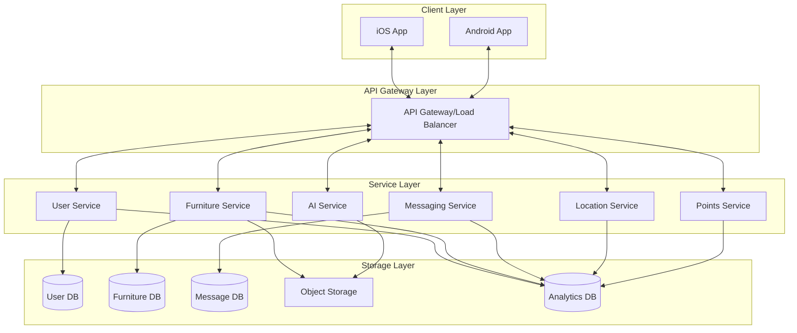

# Founditure Platform

## Human Tasks
- [ ] Configure cloud infrastructure access credentials
- [ ] Set up development environment prerequisites
- [ ] Configure CI/CD pipeline access tokens
- [ ] Set up monitoring and alerting systems
- [ ] Configure DNS and SSL certificates
- [ ] Set up external service API keys (Google Maps, Firebase, etc.)

## Overview

Founditure is a comprehensive mobile-first platform designed to combat urban furniture waste through community-driven recovery efforts. The platform consists of native mobile applications, distributed cloud infrastructure, and AI-powered services that enable users to document, discover, and coordinate the recovery of discarded furniture.

### Core Features
- User authentication and profile management
- Real-time furniture listing and discovery
- Location-based search and mapping
- In-app messaging system
- Points and achievements system
- AI-powered furniture recognition
- Push notifications
- Offline support

## System Architecture



## Technology Stack

### Mobile Applications
- iOS: Swift 5.9+, SwiftUI, Combine
- Android: Kotlin 1.9+, Jetpack Compose, Coroutines

### Backend Services
- Runtime: Node.js 18 LTS
- Framework: Express.js 4.18.2
- Language: TypeScript 5.0+

### Databases
- PostgreSQL 14 (Primary data store)
- Redis 6 (Caching & sessions)
- MongoDB 5 (Document storage)
- Elasticsearch 7.17 (Search engine)

### Infrastructure
- Cloud Platform: AWS
- Container Orchestration: Kubernetes (EKS)
- CI/CD: Jenkins
- Monitoring: Prometheus/Grafana
- Logging: ELK Stack

## Getting Started

### Prerequisites
- Git
- Docker & Docker Compose
- Node.js 18+
- Xcode 14+ (for iOS)
- Android Studio Arctic Fox+ (for Android)
- AWS CLI
- kubectl

### Repository Structure
```
founditure/
├── src/
│   ├── ios/           # iOS application
│   ├── android/       # Android application
│   └── backend/       # Backend services
├── infrastructure/    # Infrastructure as code
│   ├── terraform/     # Cloud infrastructure
│   ├── kubernetes/    # K8s configurations
│   └── docker/        # Docker configurations
└── docs/             # Documentation
```

### Development Setup

1. Clone the repository:
```bash
git clone https://github.com/founditure/founditure.git
cd founditure
```

2. Set up environment variables:
```bash
cp .env.example .env
# Edit .env with your configuration
```

3. Start development environment:
```bash
make setup
make dev
```

4. Access development services:
- Backend API: http://localhost:3000
- API Documentation: http://localhost:3000/docs
- Monitoring: http://localhost:9090
- Logging: http://localhost:5601

## Development Workflow

### Branch Strategy
- `main`: Production-ready code
- `develop`: Development branch
- `feature/*`: New features
- `bugfix/*`: Bug fixes
- `release/*`: Release preparation

### Code Quality
- Linting: ESLint, SwiftLint, ktlint
- Testing: Jest, XCTest, JUnit
- Code Review: Pull request workflow
- CI/CD: Automated builds and tests

### Testing Requirements
- Unit tests for business logic
- Integration tests for APIs
- UI tests for critical flows
- Performance testing
- Security scanning

## Deployment

### Environment Setup
1. Infrastructure provisioning:
```bash
cd infrastructure/terraform
terraform init
terraform apply
```

2. Kubernetes deployment:
```bash
kubectl apply -f infrastructure/kubernetes/
```

3. Application deployment:
```bash
make deploy ENV=production
```

### Monitoring & Logging
- Prometheus metrics: `:9090/metrics`
- Grafana dashboards: `:3000`
- Elasticsearch logs: `:9200`
- Kibana interface: `:5601`

## Documentation

### Component Documentation
- [iOS Application](src/ios/README.md)
- [Android Application](src/android/README.md)
- [Backend Services](src/backend/README.md)
- [Infrastructure](infrastructure/README.md)

### API Documentation
- OpenAPI Specification: `/docs/api-spec.yaml`
- API Documentation: `/docs/api.md`
- WebSocket Protocol: `/docs/websocket.md`

### Architecture Documentation
- System Design: `/docs/architecture.md`
- Data Models: `/docs/data-models.md`
- Security: `/docs/security.md`

## Contributing

### Getting Started
1. Fork the repository
2. Create a feature branch
3. Implement changes
4. Submit pull request

### Guidelines
- Follow coding standards
- Write comprehensive tests
- Update documentation
- Create detailed PR descriptions

## License

MIT License - see [LICENSE](LICENSE) for details

## Support

- Technical Issues: GitHub Issues
- Security Concerns: security@founditure.com
- General Inquiries: support@founditure.com