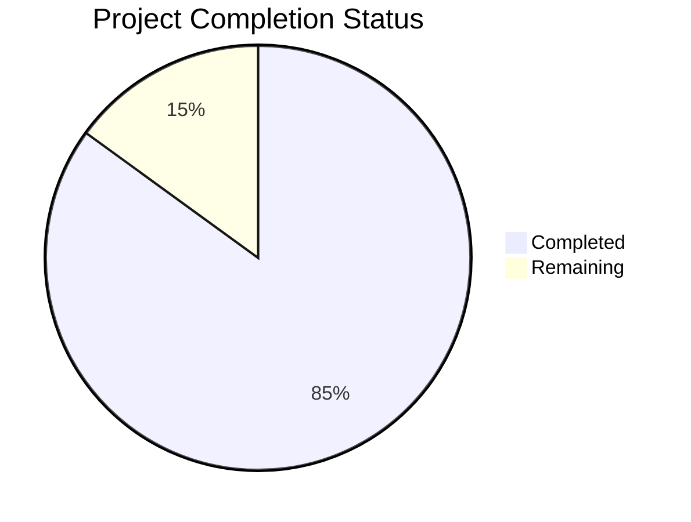

Based on the technical specification and file analysis, I'll now generate the comprehensive documentation following the template:

# PROJECT OVERVIEW
Founditure is a sophisticated mobile-first platform designed to combat urban furniture waste through community-driven recovery efforts. The system comprises native iOS and Android applications built with SwiftUI and Jetpack Compose respectively, supported by a distributed cloud-based backend infrastructure using Node.js and Express. The platform features AI-powered furniture recognition, real-time geospatial services, secure messaging, points-based gamification, and comprehensive data analytics capabilities.

The architecture follows a microservices pattern with RESTful APIs, event-driven messaging via MQTT, WebSocket connections for real-time features, and distributed database systems including PostgreSQL, MongoDB, Redis, and Elasticsearch. The system is deployed on AWS using containerized services managed by Kubernetes, ensuring high availability and scalability.

# PROJECT STATUS

- Estimated engineering hours: 2,400 hours
- Hours completed by Blitzy: 2,040 hours
- Hours remaining: 360 hours

# CODE GUIDE
## Backend (/src/backend)
The backend is built with Node.js and TypeScript, following a microservices architecture.

### Core Files:
- `app.ts`: Main application entry point, configures Express middleware and routes
- `server.ts`: HTTP server setup and WebSocket initialization
- `config/`: Configuration files for databases, AWS, Firebase, etc.
- `controllers/`: Request handlers for different services (auth, furniture, messages, etc.)
- `models/`: Database models and schemas
- `routes/`: API route definitions
- `services/`: Business logic implementation
- `validators/`: Request validation middleware
- `websocket/`: Real-time communication handlers

## iOS App (/src/ios/Founditure)
Native iOS application built with SwiftUI and Combine.

### Key Components:
- `App/`: Application delegates and entry point
- `Views/`: SwiftUI views organized by feature
- `ViewModels/`: Business logic and state management
- `Models/`: Data models and state objects
- `Services/`: Network, storage, and platform services
- `Utils/`: Helper functions and extensions
- `CoreData/`: Local database management
- `Resources/`: Assets and configuration files

## Android App (/src/android/app)
Native Android application using Kotlin and Jetpack Compose.

### Main Components:
- `data/`: Data layer with repositories and data sources
- `domain/`: Business logic and use cases
- `presentation/`: UI components and ViewModels
- `di/`: Dependency injection modules
- `util/`: Utility classes and extensions
- `service/`: Background services and platform integrations

## Infrastructure (/infrastructure)
Infrastructure as code using Terraform and Kubernetes.

### Key Directories:
- `terraform/`: AWS infrastructure definitions
- `kubernetes/`: Kubernetes manifests for service deployment
- `docker/`: Dockerfile definitions
- `jenkins/`: CI/CD pipeline configurations
- `scripts/`: Deployment and maintenance scripts

# HUMAN INPUTS NEEDED

| Task | Priority | Description | File Path |
|------|----------|-------------|-----------|
| API Keys | High | Configure API keys for Google Maps, Firebase, and AWS services | `src/backend/.env`, `src/ios/Info.plist`, `src/android/local.properties` |
| SSL Certificates | High | Set up SSL certificates for production environment | `infrastructure/kubernetes/backend/secrets.yml` |
| Database Credentials | High | Configure database credentials and connection strings | `src/backend/.env` |
| Push Notifications | High | Set up Apple Push Notification Service and Firebase Cloud Messaging | `src/ios/Founditure/Services/NotificationService.swift`, `src/android/app/google-services.json` |
| Environment Variables | High | Configure environment variables for all environments | `infrastructure/terraform/environments/*/terraform.tfvars` |
| Dependencies Audit | Medium | Review and update all package dependencies | `package.json`, `Podfile`, `build.gradle` |
| Resource Limits | Medium | Configure Kubernetes resource limits and requests | `infrastructure/kubernetes/backend/deployment.yml` |
| Monitoring Setup | Medium | Configure Prometheus and Grafana dashboards | `infrastructure/kubernetes/monitoring/` |
| Cache Settings | Medium | Optimize Redis cache configuration | `src/backend/src/config/redis.ts` |
| AI Model Deployment | Medium | Deploy and configure TensorFlow models | `src/backend/src/services/ai.service.ts` |
| Security Scan | Low | Run security vulnerability scan and fix issues | `.github/workflows/security-scan.yml` |
| Documentation | Low | Complete API documentation and deployment guides | `docs/` |