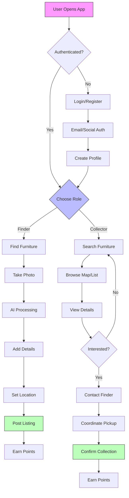
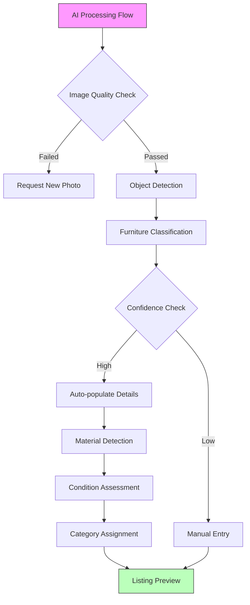
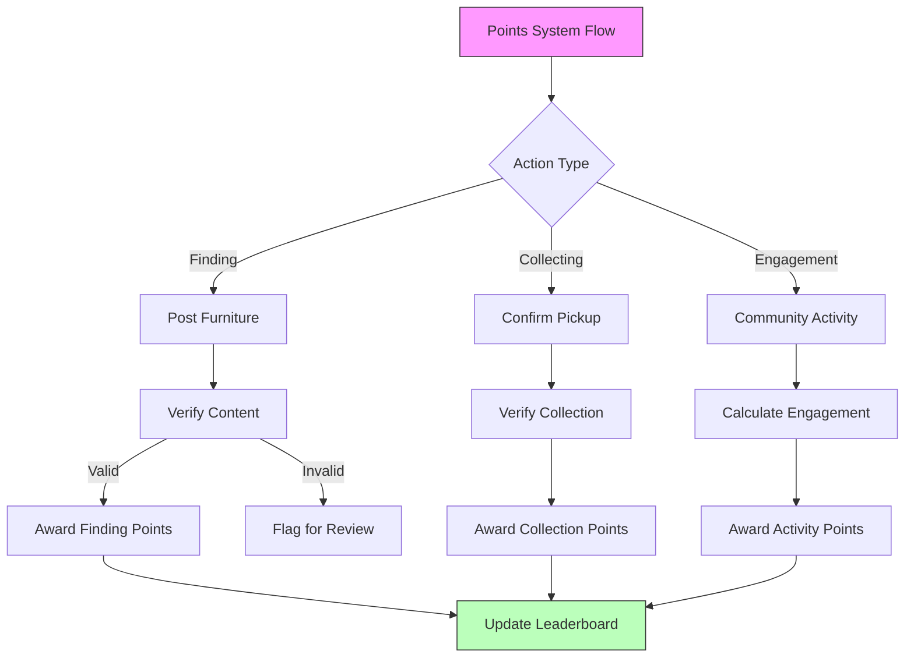
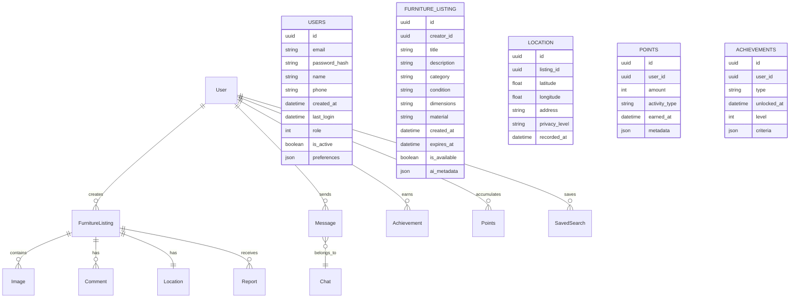
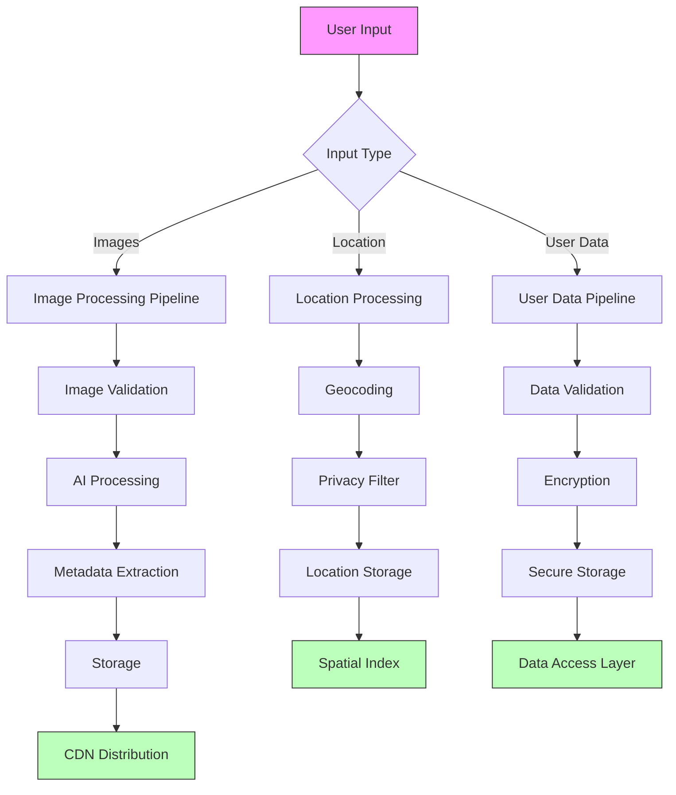
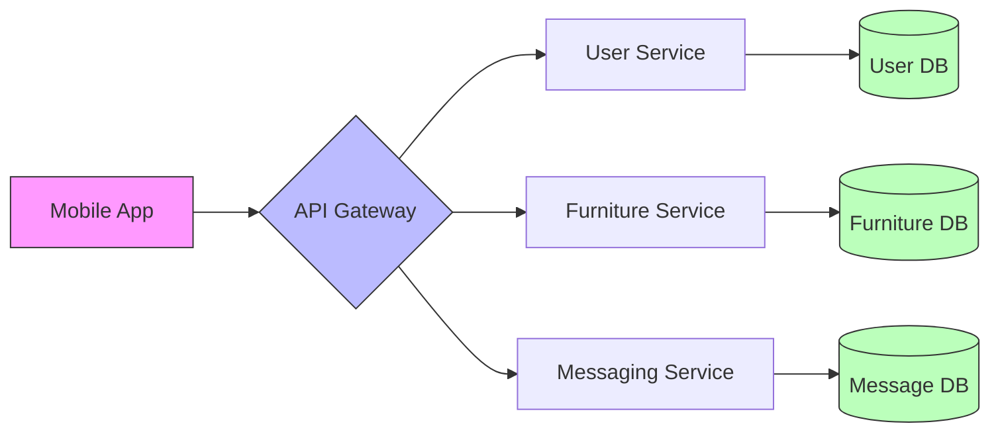

# 1. Introduction

## 1.1 Purpose

This Software Requirements Specification (SRS) document provides a detailed description of the Founditure mobile application. It is intended for:
- Development teams implementing the system
- Quality assurance teams validating requirements
- Project managers overseeing development
- Stakeholders evaluating technical specifications
- UX/UI designers creating the user interface
- System architects planning the technical infrastructure

The document establishes the basis for agreement between customers and developers on what the software product will do, serving as a blueprint for the development process.

## 1.2 Scope

Founditure is a mobile application designed to reduce urban furniture waste through community-driven recovery efforts. The system encompasses:

- Mobile applications for iOS and Android platforms
- Cloud-based backend infrastructure
- AI-powered furniture recognition system
- Real-time geolocation services
- Gamified user engagement platform

Core functionalities include:
- Furniture discovery and documentation
- Location-based search and mapping
- AI-assisted furniture categorization
- User-to-user messaging and coordination
- Points-based reward system
- Community leaderboards and achievements
- Privacy-focused user interactions
- Push notification system

The application will not include:
- Furniture delivery services
- Financial transactions
- Professional furniture listings
- Restoration services
- Direct social media integration

# 2. Product Description

## 2.1 Product Perspective
Founditure operates as a standalone mobile application within the broader ecosystem of urban sustainability solutions. The system interfaces with:

- Mobile device hardware (camera, GPS, storage)
- Cloud-based backend services
- Third-party mapping services
- AI/ML processing infrastructure
- Push notification services
- Mobile authentication providers

The application follows a client-server architecture where:
- Mobile clients handle user interactions and local processing
- Cloud servers manage data persistence and heavy computations
- AI services process image recognition and classification
- Real-time databases handle messaging and location updates

## 2.2 Product Functions

The primary functions of Founditure include:

1. Furniture Discovery and Documentation
   - Photo capture and upload
   - AI-powered furniture recognition
   - Location tagging
   - Condition assessment
   - Detailed item descriptions

2. Search and Discovery
   - Location-based furniture search
   - Category filtering
   - Distance-based results
   - Interactive map visualization
   - Saved searches and alerts

3. User Interaction
   - Private messaging system
   - Pickup coordination
   - User ratings and feedback
   - Community reporting tools

4. Gamification System
   - Points accumulation
   - Achievement tracking
   - Leaderboard rankings
   - Progress milestones
   - Community challenges

## 2.3 User Characteristics

1. Furniture Finders
   - Urban residents
   - Environmentally conscious individuals
   - Regular neighborhood walkers
   - Community activists
   - Age range: 18-65
   - Basic smartphone proficiency required

2. Furniture Collectors
   - Students and young professionals
   - Budget-conscious consumers
   - DIY enthusiasts
   - Upcycling artists
   - Sustainability advocates
   - Must have means to transport furniture

3. Community Leaders
   - Active community members
   - High engagement levels
   - Regular contributors
   - Experienced app users
   - Role models for sustainable practices

## 2.4 Constraints

1. Technical Constraints
   - Mobile device camera quality requirements
   - Minimum iOS/Android version requirements
   - Network connectivity dependencies
   - Storage limitations for photos
   - Processing power for AI features

2. Regulatory Constraints
   - Data privacy compliance (GDPR, CCPA)
   - Location data handling regulations
   - User data storage requirements
   - Age restrictions for users
   - Local waste management laws

3. Business Constraints
   - No monetary transactions within app
   - No delivery services provided
   - Geographic limitations for initial launch
   - Moderation team capacity
   - Server infrastructure costs

## 2.5 Assumptions and Dependencies

Assumptions:
- Users have consistent internet connectivity
- Sufficient furniture waste exists in target areas
- Users have transportation means for collection
- Community willingness to participate
- AI recognition accuracy meets user needs

Dependencies:
- Cloud service providers' availability
- Third-party mapping service reliability
- Mobile platform update schedules
- AI model training data quality
- User device capabilities
- Community engagement levels
- Local municipality cooperation
- Weather conditions for outdoor furniture

## 2.6 Process Flowchart







# 3. Functional Requirements

| ID | Feature | Description | Priority |
|---|---|---|---|
| F1 | User Authentication | Core user access and management functionality | High |
| F1.1 | Registration | Email and social media registration with profile creation | High |
| F1.2 | Login | Secure authentication with multi-factor option | High |
| F1.3 | Profile Management | Edit personal information and preferences | Medium |
| F1.4 | Role Selection | Toggle between finder/collector roles | High |

| ID | Feature | Description | Priority |
|---|---|---|---|
| F2 | Furniture Documentation | Core furniture listing functionality | High |
| F2.1 | Photo Capture | In-app camera integration with quality checks | High |
| F2.2 | AI Recognition | Automatic furniture type and condition detection | High |
| F2.3 | Location Tagging | GPS-based location recording with privacy zones | High |
| F2.4 | Manual Entry | Form-based furniture details input | Medium |
| F2.5 | Multi-photo Support | Upload multiple images per listing | Medium |

| ID | Feature | Description | Priority |
|---|---|---|---|
| F3 | Search and Discovery | Furniture finding functionality | High |
| F3.1 | Map View | Interactive map showing furniture locations | High |
| F3.2 | List View | Scrollable list of available furniture | High |
| F3.3 | Filters | Category, distance, and condition filtering | Medium |
| F3.4 | Saved Searches | Save and receive alerts for search criteria | Low |
| F3.5 | Item Details | Detailed view of furniture listings | High |

| ID | Feature | Description | Priority |
|---|---|---|---|
| F4 | Messaging System | User communication functionality | High |
| F4.1 | Direct Messages | Private messaging between users | High |
| F4.2 | Pickup Coordination | Structured pickup arrangement workflow | High |
| F4.3 | Push Notifications | Real-time alerts for messages and updates | Medium |
| F4.4 | Chat History | Message archive and management | Low |

| ID | Feature | Description | Priority |
|---|---|---|---|
| F5 | Gamification | User engagement and rewards system | Medium |
| F5.1 | Points System | Point allocation for various activities | Medium |
| F5.2 | Leaderboards | Global and local ranking displays | Medium |
| F5.3 | Achievements | Milestone-based badges and rewards | Low |
| F5.4 | Challenges | Time-limited community challenges | Low |

| ID | Feature | Description | Priority |
|---|---|---|---|
| F6 | Safety and Moderation | Community protection features | High |
| F6.1 | Content Reporting | Report inappropriate content/behavior | High |
| F6.2 | User Blocking | Block problematic users | High |
| F6.3 | AI Moderation | Automatic content screening | Medium |
| F6.4 | Safety Guidelines | In-app safety information | Medium |

| ID | Feature | Description | Priority |
|---|---|---|---|
| F7 | Location Services | Geographic functionality | High |
| F7.1 | Current Location | Real-time user location detection | High |
| F7.2 | Search Radius | Customizable search area settings | Medium |
| F7.3 | Location Privacy | Location masking and privacy controls | High |
| F7.4 | Navigation | Directions to furniture locations | Medium |

| ID | Feature | Description | Priority |
|---|---|---|---|
| F8 | Data Management | Backend data handling | High |
| F8.1 | Image Storage | Compressed image storage and delivery | High |
| F8.2 | User Data | Secure personal information management | High |
| F8.3 | Analytics | Usage and performance tracking | Medium |
| F8.4 | Data Export | User data portability | Low |

# 4. Non-Functional Requirements

## 4.1 Performance Requirements

| Metric | Requirement |
|--------|-------------|
| App Launch Time | < 3 seconds on 4G networks |
| Image Upload | < 5 seconds for compressed images |
| AI Recognition | < 5 seconds per furniture item |
| Map Loading | < 2 seconds for initial render |
| Message Delivery | < 1 second for real-time messages |
| Search Results | < 2 seconds for filtered queries |
| Location Updates | < 500ms for GPS position refresh |
| Maximum Users | Support 100,000 concurrent users |
| Database Queries | < 100ms response time |
| Push Notifications | < 5 seconds delivery time |

## 4.2 Safety Requirements

| Category | Requirement |
|----------|-------------|
| Data Backup | Hourly incremental backups with 30-day retention |
| Failure Recovery | Automatic failover within 30 seconds |
| Error Handling | Graceful degradation of non-critical features |
| Data Integrity | Checksums for all uploaded content |
| User Protection | Anonymous location sharing until pickup confirmation |
| Emergency Support | 24/7 incident response team |
| Content Validation | AI-powered inappropriate content detection |
| Fault Tolerance | 99.9% service availability |
| System Monitoring | Real-time performance and security monitoring |
| Disaster Recovery | Recovery Point Objective (RPO) of 1 hour |

## 4.3 Security Requirements

| Feature | Specification |
|---------|---------------|
| Authentication | Multi-factor authentication support |
| Authorization | Role-based access control (RBAC) |
| Data Encryption | AES-256 for data at rest |
| Transport Security | TLS 1.3 for all communications |
| Session Management | 30-minute timeout with refresh tokens |
| Password Policy | Minimum 12 characters with complexity requirements |
| API Security | OAuth 2.0 with JWT tokens |
| Data Privacy | GDPR and CCPA compliance |
| Audit Logging | All security events logged and retained for 90 days |
| Vulnerability Scanning | Weekly automated security scans |

## 4.4 Quality Requirements

### 4.4.1 Availability
- 99.9% uptime during peak hours (8AM-10PM local time)
- Planned maintenance windows during off-peak hours
- Maximum unplanned downtime of 1 hour per month

### 4.4.2 Maintainability
- Modular architecture with microservices
- Automated deployment pipeline
- Comprehensive API documentation
- Code coverage minimum of 80%
- Automated testing suite

### 4.4.3 Usability
- Maximum 3 clicks to core functions
- Support for accessibility standards (WCAG 2.1)
- Multilingual support for top 5 local languages
- Intuitive UI with consistent design patterns
- Offline mode for basic functionality

### 4.4.4 Scalability
- Horizontal scaling capability
- Auto-scaling based on user load
- Content Delivery Network (CDN) integration
- Database sharding support
- Microservices architecture

### 4.4.5 Reliability
- Mean Time Between Failures (MTBF) > 720 hours
- Mean Time To Recovery (MTTR) < 30 minutes
- Zero data loss during system failures
- Automated system health checks
- Regular backup verification

## 4.5 Compliance Requirements

| Requirement | Description |
|-------------|-------------|
| Data Protection | GDPR and CCPA compliance for user data handling |
| Accessibility | WCAG 2.1 Level AA compliance |
| Mobile Standards | iOS App Store and Google Play Store guidelines |
| Location Services | Local privacy laws for location data collection |
| Image Storage | Copyright and content ownership policies |
| User Age | Age verification for users under 18 |
| Terms of Service | Clear user agreements and privacy policies |
| Data Portability | User data export functionality |
| Reporting | Automated compliance reporting system |
| Documentation | Maintenance of compliance documentation |

# 5. Data Requirements

## 5.1 Data Models



## 5.2 Data Storage

### 5.2.1 Storage Requirements

| Data Type | Storage System | Retention Period | Backup Frequency |
|-----------|---------------|------------------|------------------|
| User Profiles | Primary Database | Account lifetime + 2 years | Daily |
| Furniture Listings | Primary Database | 1 year after completion | Daily |
| Images | Object Storage | 1 year after listing expiry | Weekly |
| Messages | Primary Database | 6 months | Daily |
| Location Data | Primary Database | 30 days after listing completion | Daily |
| Activity Logs | Time-series Database | 90 days | Weekly |
| Analytics Data | Data Warehouse | 3 years | Monthly |
| AI Training Data | Object Storage | Indefinite | Monthly |

### 5.2.2 Redundancy and Backup

- Primary database with multi-region replication
- Hot standby databases for immediate failover
- Daily incremental backups retained for 30 days
- Weekly full backups retained for 6 months
- Monthly archives retained for 3 years
- Cross-region backup replication
- Point-in-time recovery capability within 30 days

### 5.2.3 Data Recovery

- Recovery Time Objective (RTO): 1 hour
- Recovery Point Objective (RPO): 5 minutes
- Automated failover for high availability
- Documented recovery procedures
- Regular recovery testing schedule
- Data consistency validation tools
- Backup integrity verification

## 5.3 Data Processing



### 5.3.1 Data Security

| Security Layer | Implementation |
|----------------|----------------|
| Data at Rest | AES-256 encryption |
| Data in Transit | TLS 1.3 |
| Access Control | Role-based access control (RBAC) |
| Key Management | AWS KMS or equivalent |
| Data Masking | PII redaction |
| Audit Logging | All data access logged |
| Compliance | GDPR/CCPA standards |

### 5.3.2 Data Processing Requirements

- Real-time image processing for furniture listings
- Asynchronous AI model inference
- Batch processing for analytics
- Stream processing for user activity
- Location data anonymization
- Message queue processing
- Cache invalidation
- Data aggregation for leaderboards
- Automated data cleanup processes
- ETL pipelines for reporting

# 6. External Interfaces

## 6.1 User Interfaces

### 6.1.1 Mobile Application UI Requirements

| Screen | Core Elements | Requirements |
|--------|--------------|--------------|
| Login/Register | - Email/social login buttons<br>- Registration form<br>- Password recovery | - Maximum 2 screens deep<br>- Clear validation feedback<br>- Social provider logos |
| Home Dashboard | - Role toggle<br>- Recent listings<br>- Points summary<br>- Quick actions | - Single page overview<br>- Pull-to-refresh<br>- Action shortcuts |
| Map View | - Interactive map<br>- List toggle<br>- Filter controls<br>- Search bar | - Clustering markers<br>- Smooth zoom/pan<br>- Location centering |
| Camera/Upload | - Camera preview<br>- Photo gallery access<br>- AI feedback overlay | - Real-time preview<br>- Multiple photo support<br>- Progress indication |
| Messaging | - Chat list<br>- Conversation view<br>- Quick responses | - Message status indicators<br>- Typing indicators<br>- Media support |

### 6.1.2 Design Requirements

- Material Design 3 for Android
- iOS Human Interface Guidelines compliance
- Dark/light mode support
- Responsive layouts for different screen sizes
- Minimum touch target size of 44x44 points
- High contrast accessibility mode
- Dynamic text sizing support

## 6.2 Hardware Interfaces

### 6.2.1 Mobile Device Requirements

| Component | Interface Requirements |
|-----------|----------------------|
| Camera | - Minimum 8MP resolution<br>- Auto-focus capability<br>- Flash control<br>- Image stabilization |
| GPS | - Location accuracy within 10 meters<br>- Background location updates<br>- Geofencing support |
| Storage | - Local cache management<br>- External storage access<br>- Minimum 100MB free space |
| Network | - WiFi and cellular data support<br>- Offline mode capabilities<br>- Bandwidth optimization |
| Sensors | - Compass for map orientation<br>- Accelerometer for image orientation<br>- Ambient light for UI adaptation |

## 6.3 Software Interfaces

### 6.3.1 External Services Integration

| Service | Interface Type | Purpose |
|---------|---------------|----------|
| Maps API | REST API | - Location rendering<br>- Geocoding<br>- Route calculation |
| Cloud Storage | SDK | - Image storage<br>- File management<br>- CDN distribution |
| Authentication | OAuth 2.0 | - Social login<br>- Token management<br>- Session handling |
| AI Services | gRPC | - Image recognition<br>- Object detection<br>- Classification |
| Analytics | SDK | - Usage tracking<br>- Performance monitoring<br>- Crash reporting |

### 6.3.2 Database Interfaces



## 6.4 Communication Interfaces

### 6.4.1 Network Protocols

| Protocol | Usage | Requirements |
|----------|-------|--------------|
| HTTPS | API Communication | - TLS 1.3<br>- Certificate pinning<br>- Request timeout: 30s |
| WebSocket | Real-time Messages | - Heartbeat interval: 30s<br>- Auto-reconnect<br>- Message compression |
| MQTT | Push Notifications | - QoS Level 1<br>- Persistent sessions<br>- Topic-based filtering |

### 6.4.2 API Requirements

- RESTful architecture
- JSON data format
- Compression: gzip
- Rate limiting: 100 requests/minute
- Authentication: JWT tokens
- API versioning support
- CORS configuration
- Cache-Control headers
- Request/Response logging

### 6.4.3 Data Exchange Formats

```json
{
  "furniture_listing": {
    "id": "uuid",
    "type": "string",
    "location": {
      "lat": "float",
      "lng": "float",
      "accuracy": "float"
    },
    "images": ["url"],
    "metadata": {
      "ai_confidence": "float",
      "dimensions": "object",
      "condition": "string"
    },
    "timestamps": {
      "created": "iso8601",
      "updated": "iso8601",
      "expires": "iso8601"
    }
  }
}
```

# APPENDICES

## A. Glossary

| Term | Definition |
|------|------------|
| Finder | User who documents and posts discarded furniture |
| Collector | User who searches for and collects posted furniture |
| Recovery | The act of collecting and repurposing discarded furniture |
| Listing | A posted furniture item with photos, location, and details |
| Points | Gamification currency earned through app activities |
| Achievement | Milestone-based rewards for user activities |
| Privacy Zone | Area where exact location is masked for safety |
| Community Leader | Highly engaged users with exemplary contribution records |

## B. Acronyms

| Acronym | Definition |
|---------|------------|
| AI | Artificial Intelligence |
| API | Application Programming Interface |
| CDN | Content Delivery Network |
| CORS | Cross-Origin Resource Sharing |
| ETL | Extract, Transform, Load |
| GDPR | General Data Protection Regulation |
| GPS | Global Positioning System |
| JWT | JSON Web Token |
| ML | Machine Learning |
| MQTT | Message Queuing Telemetry Transport |
| OAuth | Open Authorization |
| PII | Personally Identifiable Information |
| QoS | Quality of Service |
| RBAC | Role-Based Access Control |
| REST | Representational State Transfer |
| SDK | Software Development Kit |
| TLS | Transport Layer Security |
| UI | User Interface |
| UUID | Universally Unique Identifier |
| WCAG | Web Content Accessibility Guidelines |

## C. Additional References

| Resource | Description | URL |
|----------|-------------|-----|
| Material Design 3 | UI design system for Android | https://m3.material.io/ |
| iOS HIG | Apple's Human Interface Guidelines | https://developer.apple.com/design/human-interface-guidelines/ |
| OAuth 2.0 | Authentication protocol specification | https://oauth.net/2/ |
| WCAG 2.1 | Web accessibility guidelines | https://www.w3.org/WAI/standards-guidelines/wcag/ |
| GDPR | EU data protection regulation | https://gdpr.eu/ |
| CCPA | California Consumer Privacy Act | https://oag.ca.gov/privacy/ccpa |
| gRPC | High-performance RPC framework | https://grpc.io/ |
| WebSocket | Real-time communication protocol | https://websocket.org/ |