# 1. Introduction

## 1.1 System Overview

Founditure is a comprehensive mobile-first platform designed to combat urban furniture waste through community-driven recovery efforts. The system consists of:

- Native mobile applications for iOS and Android platforms
- Distributed cloud-based backend infrastructure
- AI/ML processing pipeline for furniture recognition
- Real-time geospatial services
- Secure messaging and user management systems
- Points-based gamification engine
- Content delivery network for media assets
- Data analytics and reporting infrastructure

The system architecture follows a microservices pattern with:
- RESTful API gateway for client-server communication
- Event-driven messaging using MQTT
- WebSocket connections for real-time features
- Distributed database systems for different data types
- Containerized services for scalability
- Load-balanced application servers
- Redundant storage systems
- Multi-region deployment

## 1.2 Scope

### Core System Components

1. Mobile Applications
   - Native iOS application (iOS 14+)
   - Native Android application (Android 8.0+)
   - Cross-platform shared business logic
   - Offline-first architecture
   - Local data persistence

2. Backend Services
   - User authentication and authorization
   - Furniture listing management
   - Real-time messaging system
   - Points and achievements engine
   - Location services
   - Content moderation
   - Analytics pipeline

3. AI/ML Infrastructure
   - Image recognition models
   - Object detection system
   - Classification services
   - Training pipeline
   - Model versioning
   - Inference optimization

4. Data Management
   - Distributed database clusters
   - Object storage for media
   - Cache layers
   - Backup systems
   - Data warehousing
   - ETL processes

### Included Features

- User registration and authentication
- Furniture documentation and discovery
- Location-based search
- Real-time messaging
- Points system and leaderboards
- Push notifications
- Content moderation
- Privacy controls
- Analytics and reporting
- Administrative tools

### Excluded Features

- Payment processing
- Delivery services
- Professional listings
- Furniture restoration
- Direct social media posting
- User-to-user financial transactions
- Furniture valuation
- Insurance coverage
- Background checks
- Direct marketplace functionality

# 3. System Architecture

## 3.1 High-Level Architecture Overview

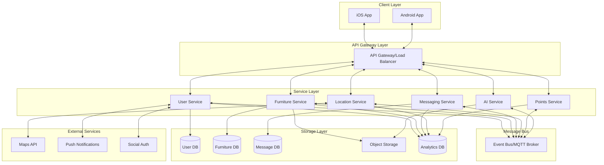
```mermaid
flowchart TB
    subgraph Client Layer
        A1[iOS App]
        A2[Android App]
    end

    subgraph API Gateway Layer
        B[API Gateway/Load Balancer]
    end

    subgraph Service Layer
        C1[User Service]
        C2[Furniture Service]
        C3[Messaging Service]
        C4[Location Service]
        C5[Points Service]
        C6[AI Service]
    end

    subgraph Message Bus
        D[Event Bus/MQTT Broker]
    end

    subgraph Storage Layer
        E1[(User DB)]
        E2[(Furniture DB)]
        E3[(Message DB)]
        E4[Object Storage]
        E5[(Analytics DB)]
    end

    subgraph External Services
        F1[Maps API]
        F2[Push Notifications]
        F3[Social Auth]
    end

    A1 & A2 <--> B
    B <--> C1 & C2 & C3 & C4 & C5 & C6
    C1 & C2 & C3 & C4 & C5 & C6 <--> D
    C1 --> E1
    C2 --> E2
    C3 --> E3
    C2 & C6 --> E4
    C1 & C2 & C3 & C4 & C5 --> E5
    C4 <--> F1
    C1 <--> F2
    C1 <--> F3
```

## 3.2 Component Architecture

### 3.2.1 Mobile Client Architecture

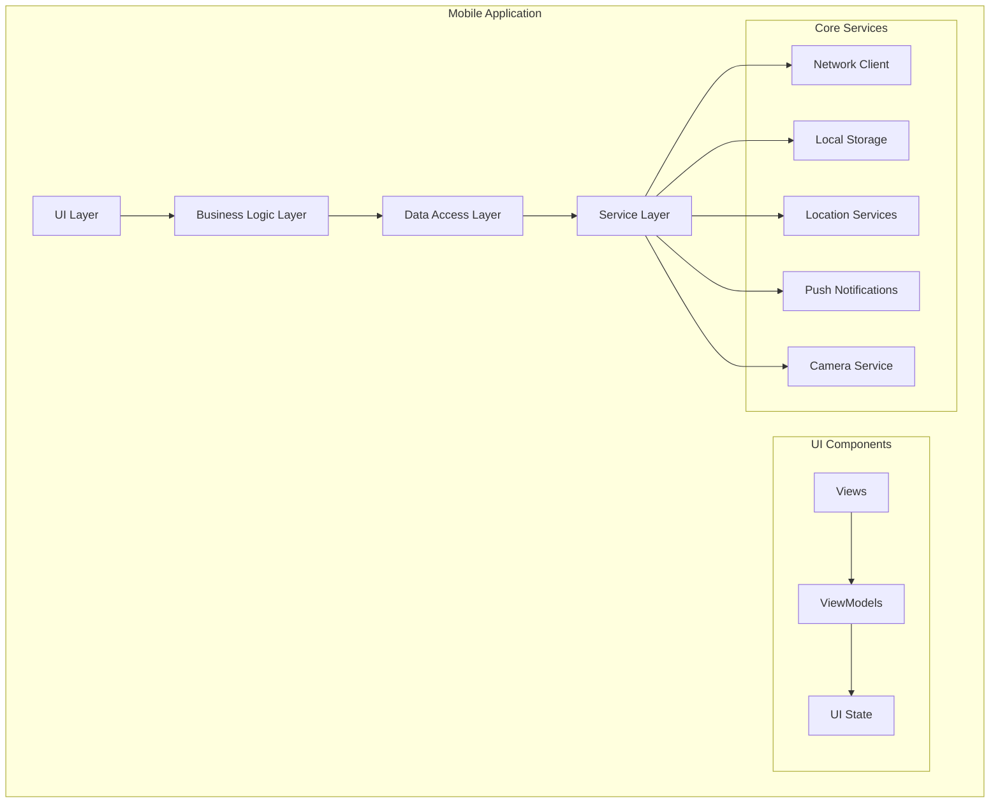
```mermaid
flowchart TB
    subgraph Mobile Application
        A[UI Layer]
        B[Business Logic Layer]
        C[Data Access Layer]
        D[Service Layer]

        subgraph UI Components
            A1[Views]
            A2[ViewModels]
            A3[UI State]
        end

        subgraph Core Services
            D1[Network Client]
            D2[Local Storage]
            D3[Location Services]
            D4[Push Notifications]
            D5[Camera Service]
        end
    end

    A --> B
    B --> C
    C --> D
    A1 --> A2 --> A3
    D --> D1 & D2 & D3 & D4 & D5
```

### 3.2.2 Backend Service Architecture

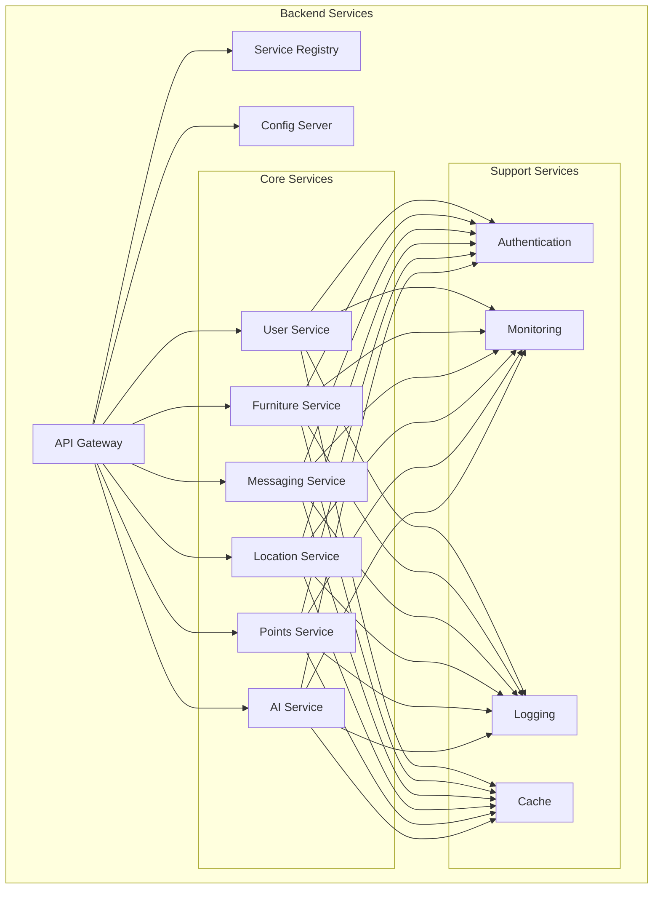
```mermaid
flowchart TB
    subgraph Backend Services
        A[API Gateway]
        B[Service Registry]
        C[Config Server]
        
        subgraph Core Services
            D1[User Service]
            D2[Furniture Service]
            D3[Messaging Service]
            D4[Location Service]
            D5[Points Service]
            D6[AI Service]
        end
        
        subgraph Support Services
            E1[Authentication]
            E2[Monitoring]
            E3[Logging]
            E4[Cache]
        end
    end

    A --> B
    A --> C
    A --> D1 & D2 & D3 & D4 & D5 & D6
    D1 & D2 & D3 & D4 & D5 & D6 --> E1 & E2 & E3 & E4
```

## 3.3 Technology Stack

### 3.3.1 Client Technologies
- iOS: Swift, SwiftUI, Combine
- Android: Kotlin, Jetpack Compose, Coroutines
- Shared: Protocol Buffers, SQLite, Retrofit

### 3.3.2 Backend Technologies
- Runtime: Node.js
- Framework: Express.js
- API: REST, WebSocket, gRPC
- Message Queue: MQTT
- Cache: Redis
- Search: Elasticsearch

### 3.3.3 Data Storage
- Primary Database: PostgreSQL
- Document Store: MongoDB
- Object Storage: AWS S3
- Time Series: InfluxDB
- Cache Layer: Redis

### 3.3.4 Infrastructure
- Cloud Platform: AWS
- Container Orchestration: Kubernetes
- CI/CD: Jenkins
- Monitoring: Prometheus/Grafana
- Logging: ELK Stack

## 3.4 System Interactions

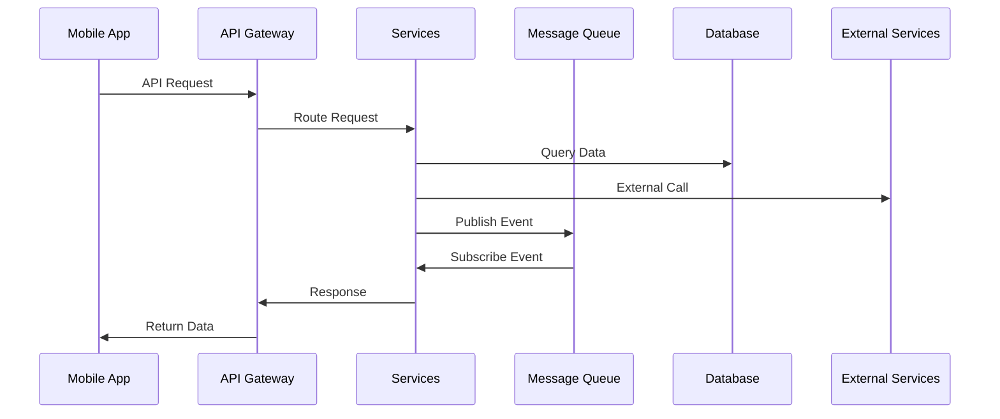
```mermaid
sequenceDiagram
    participant M as Mobile App
    participant G as API Gateway
    participant S as Services
    participant Q as Message Queue
    participant D as Database
    participant E as External Services

    M->>G: API Request
    G->>S: Route Request
    S->>D: Query Data
    S->>E: External Call
    S->>Q: Publish Event
    Q->>S: Subscribe Event
    S->>G: Response
    G->>M: Return Data
```

## 3.5 Scalability Architecture

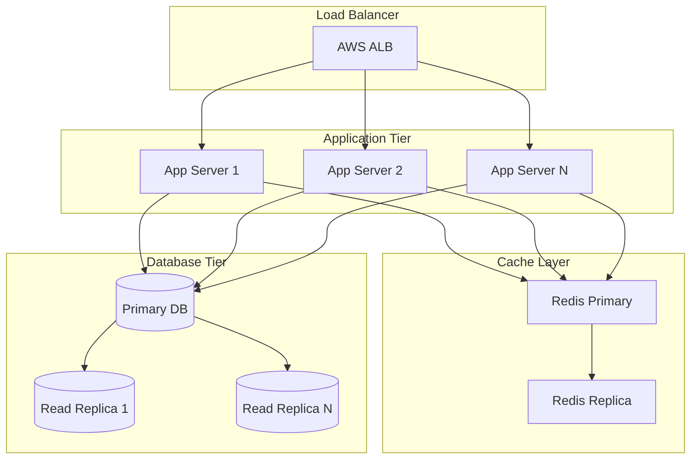
```mermaid
flowchart TB
    subgraph Load Balancer
        LB[AWS ALB]
    end

    subgraph Application Tier
        A1[App Server 1]
        A2[App Server 2]
        A3[App Server N]
    end

    subgraph Cache Layer
        C1[Redis Primary]
        C2[Redis Replica]
    end

    subgraph Database Tier
        D1[(Primary DB)]
        D2[(Read Replica 1)]
        D3[(Read Replica N)]
    end

    LB --> A1 & A2 & A3
    A1 & A2 & A3 --> C1
    C1 --> C2
    A1 & A2 & A3 --> D1
    D1 --> D2 & D3
```

## 3.6 Security Architecture

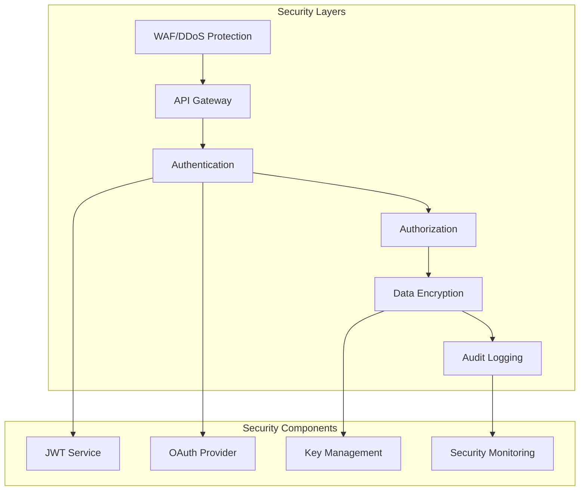
```mermaid
flowchart TB
    subgraph Security Layers
        A[WAF/DDoS Protection]
        B[API Gateway]
        C[Authentication]
        D[Authorization]
        E[Data Encryption]
        F[Audit Logging]
    end

    A --> B --> C --> D --> E --> F

    subgraph Security Components
        G[JWT Service]
        H[OAuth Provider]
        I[Key Management]
        J[Security Monitoring]
    end

    C --> G & H
    E --> I
    F --> J
```

# 4. System Components

## 4.1 Component Diagrams

### 4.1.1 Mobile Application Components

```mermaid
flowchart TB
    subgraph Mobile Client
        UI[UI Layer]
        BL[Business Logic]
        DAL[Data Access Layer]
        
        subgraph UI Components
            Screens[Screens]
            Nav[Navigation]
            Common[Common Components]
        end
        
        subgraph Core Services
            Auth[Authentication]
            Camera[Camera Service]
            Location[Location Service]
            Storage[Local Storage]
            Network[Network Client]
        end
        
        subgraph Features
            Furniture[Furniture Manager]
            Messages[Message Handler]
            Points[Points Engine]
            Search[Search Manager]
        end
    end
    
    UI --> BL
    BL --> DAL
    DAL --> Core Services
    Features --> Core Services
```

### 4.1.2 Backend Components

```mermaid
flowchart TB
    subgraph API Layer
        Gateway[API Gateway]
        Auth[Auth Service]
        Rate[Rate Limiter]
    end
    
    subgraph Core Services
        User[User Service]
        Furniture[Furniture Service]
        Message[Message Service]
        Points[Points Service]
        Location[Location Service]
        AI[AI Service]
    end
    
    subgraph Data Layer
        Cache[Redis Cache]
        UserDB[(User Database)]
        FurnitureDB[(Furniture Database)]
        MessageDB[(Message Database)]
        ObjectStore[S3 Storage]
    end
    
    Gateway --> Auth
    Gateway --> Rate
    Auth --> User
    Rate --> Core Services
    
    User --> Cache
    User --> UserDB
    Furniture --> Cache
    Furniture --> FurnitureDB
    Furniture --> ObjectStore
    Message --> MessageDB
    Points --> UserDB
    Location --> Cache
    AI --> ObjectStore
```

## 4.2 Sequence Diagrams

### 4.2.1 Furniture Listing Creation

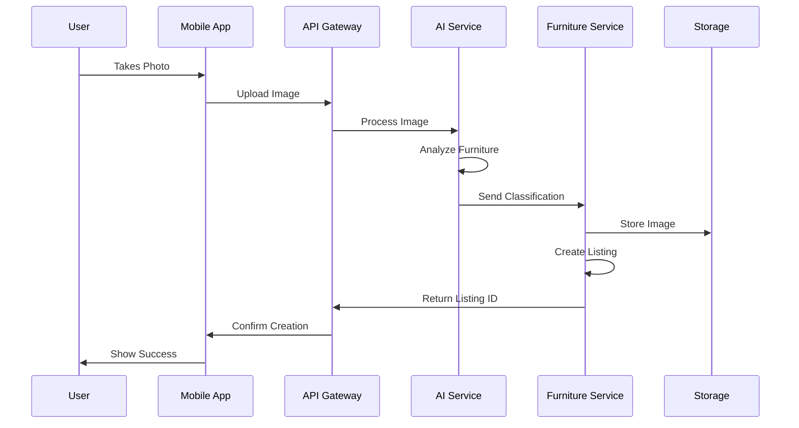
```mermaid
sequenceDiagram
    participant U as User
    participant A as Mobile App
    participant G as API Gateway
    participant AI as AI Service
    participant F as Furniture Service
    participant S as Storage
    
    U->>A: Takes Photo
    A->>G: Upload Image
    G->>AI: Process Image
    AI->>AI: Analyze Furniture
    AI->>F: Send Classification
    F->>S: Store Image
    F->>F: Create Listing
    F->>G: Return Listing ID
    G->>A: Confirm Creation
    A->>U: Show Success
```

### 4.2.2 Real-time Messaging

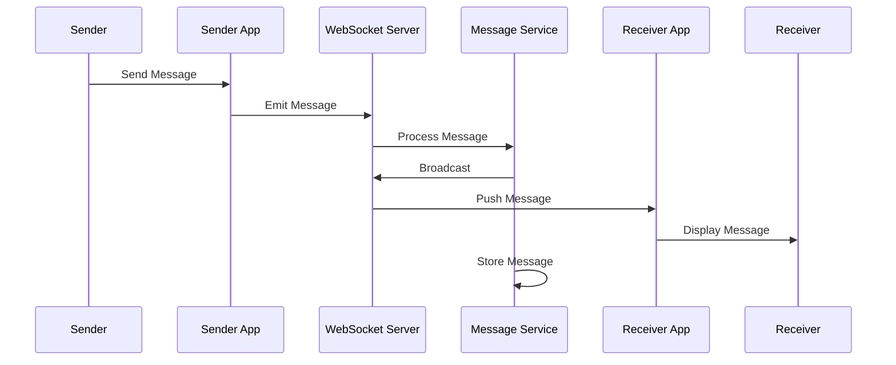
```mermaid
sequenceDiagram
    participant S1 as Sender
    participant A1 as Sender App
    participant WS as WebSocket Server
    participant M as Message Service
    participant A2 as Receiver App
    participant S2 as Receiver
    
    S1->>A1: Send Message
    A1->>WS: Emit Message
    WS->>M: Process Message
    M->>WS: Broadcast
    WS->>A2: Push Message
    A2->>S2: Display Message
    M->>M: Store Message
```

## 4.3 Data Flow Diagram

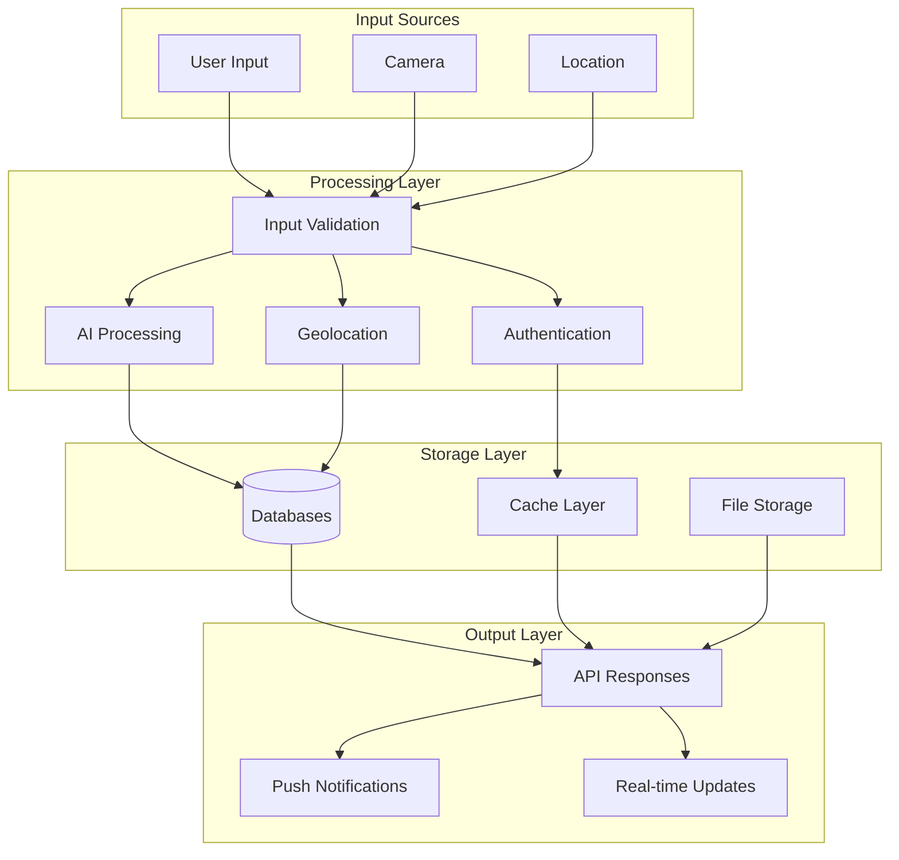
```mermaid
flowchart TB
    subgraph Input Sources
        U[User Input]
        C[Camera]
        L[Location]
    end
    
    subgraph Processing Layer
        V[Input Validation]
        AI[AI Processing]
        GEO[Geolocation]
        AUTH[Authentication]
    end
    
    subgraph Storage Layer
        DB[(Databases)]
        CACHE[Cache Layer]
        FILES[File Storage]
    end
    
    subgraph Output Layer
        API[API Responses]
        PUSH[Push Notifications]
        REAL[Real-time Updates]
    end
    
    U --> V
    C --> V
    L --> V
    
    V --> AI
    V --> GEO
    V --> AUTH
    
    AI --> DB
    GEO --> DB
    AUTH --> CACHE
    
    DB --> API
    CACHE --> API
    FILES --> API
    
    API --> PUSH
    API --> REAL
```

### 4.3.1 Data Flow Matrix

| Source | Processor | Storage | Output |
|--------|-----------|----------|---------|
| User Input | Input Validation | User Database | API Response |
| Camera Feed | AI Processing | Object Storage | Push Notification |
| Location Data | Geolocation Service | Cache Layer | Real-time Update |
| Authentication | Auth Service | Session Store | Status Message |
| Messages | Message Handler | Message Database | WebSocket Event |
| Search Query | Search Engine | Search Index | Results List |

### 4.3.2 Component Dependencies

| Component | Dependencies | Purpose |
|-----------|--------------|----------|
| API Gateway | Auth Service, Rate Limiter | Request routing and validation |
| User Service | Database, Cache, Auth | User management and profiles |
| Furniture Service | AI Service, Storage, Database | Furniture listing management |
| Message Service | WebSocket, Database | Real-time communication |
| Points Service | Database, Cache | Gamification logic |
| Location Service | Geolocation, Cache | Location processing |
| AI Service | ML Models, Object Storage | Image analysis and classification |

# 5. Technology Stack

## 5.1 Programming Languages

| Platform | Language | Version | Justification |
|----------|----------|---------|---------------|
| iOS | Swift | 5.9+ | Native performance, SwiftUI support, modern concurrency |
| Android | Kotlin | 1.9+ | Modern Android development, Coroutines support, Jetpack Compose compatibility |
| Backend | Node.js | 18 LTS | Async I/O, large ecosystem, real-time capabilities |
| AI/ML | Python | 3.9+ | Rich ML libraries, TensorFlow/PyTorch support |
| DevOps | TypeScript | 5.0+ | Type safety for infrastructure code, AWS CDK support |

## 5.2 Frameworks and Libraries

### 5.2.1 Mobile Frameworks

| Platform | Framework | Purpose |
|----------|-----------|----------|
| iOS | SwiftUI | UI framework |
| iOS | Combine | Reactive programming |
| iOS | CoreML | On-device ML |
| Android | Jetpack Compose | UI framework |
| Android | Coroutines | Async programming |
| Android | CameraX | Camera integration |
| Both | Protocol Buffers | Data serialization |

### 5.2.2 Backend Frameworks

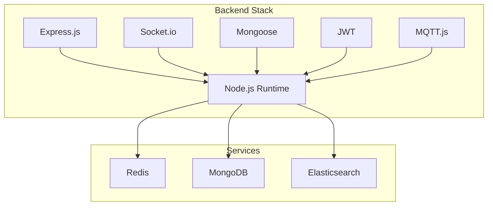
```mermaid
flowchart TB
    subgraph Backend Stack
        A[Express.js] --> B[Node.js Runtime]
        C[Socket.io] --> B
        D[Mongoose] --> B
        E[JWT] --> B
        F[MQTT.js] --> B
    end
    
    subgraph Services
        G[Redis]
        H[MongoDB]
        I[Elasticsearch]
    end
    
    B --> G & H & I
```

## 5.3 Databases

| Database | Type | Purpose | Key Features |
|----------|------|---------|--------------|
| PostgreSQL | Relational | User data, transactions | ACID compliance, PostGIS |
| MongoDB | Document | Furniture listings | Flexible schema, geospatial |
| Redis | In-memory | Caching, sessions | Fast access, pub/sub |
| InfluxDB | Time-series | Metrics, analytics | Time-based queries |
| Elasticsearch | Search | Full-text search | Geospatial search |

## 5.4 Third-Party Services

### 5.4.1 AWS Services

| Service | Purpose |
|---------|----------|
| ECS | Container orchestration |
| S3 | Object storage |
| CloudFront | CDN |
| RDS | Database hosting |
| ElastiCache | Redis hosting |
| SQS/SNS | Message queuing |
| Lambda | Serverless functions |
| CloudWatch | Monitoring |

### 5.4.2 External APIs

| Service | Purpose | Integration Type |
|---------|----------|-----------------|
| Google Maps | Location services | REST API |
| Firebase | Authentication | SDK |
| Twilio | SMS notifications | REST API |
| TensorFlow Serving | ML model serving | gRPC |
| Sentry | Error tracking | SDK |
| DataDog | APM | Agent |

## 5.5 Infrastructure Stack

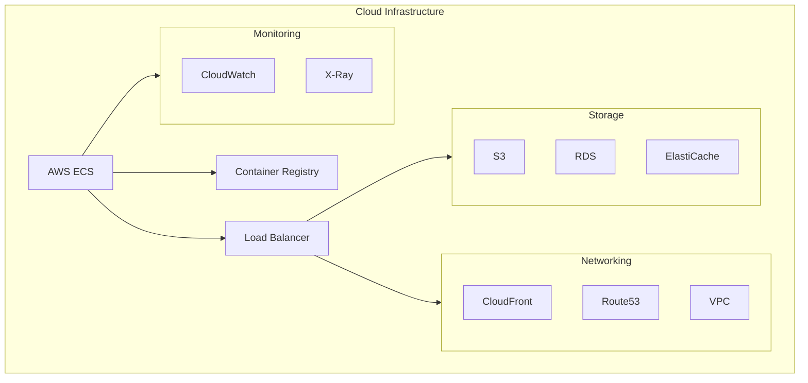
```mermaid
flowchart TB
    subgraph Cloud Infrastructure
        A[AWS ECS] --> B[Container Registry]
        A --> C[Load Balancer]
        
        subgraph Storage
            D[S3]
            E[RDS]
            F[ElastiCache]
        end
        
        subgraph Networking
            G[CloudFront]
            H[Route53]
            I[VPC]
        end
        
        subgraph Monitoring
            J[CloudWatch]
            K[X-Ray]
        end
    end
    
    C --> Storage
    C --> Networking
    A --> Monitoring
```

### 5.5.1 DevOps Tools

| Tool | Purpose |
|------|----------|
| Docker | Containerization |
| Kubernetes | Container orchestration |
| Terraform | Infrastructure as code |
| Jenkins | CI/CD |
| Prometheus | Metrics collection |
| Grafana | Monitoring visualization |
| ELK Stack | Log management |

# 6. System Design

## 6.1 User Interface Design

### 6.1.1 Mobile Navigation Structure

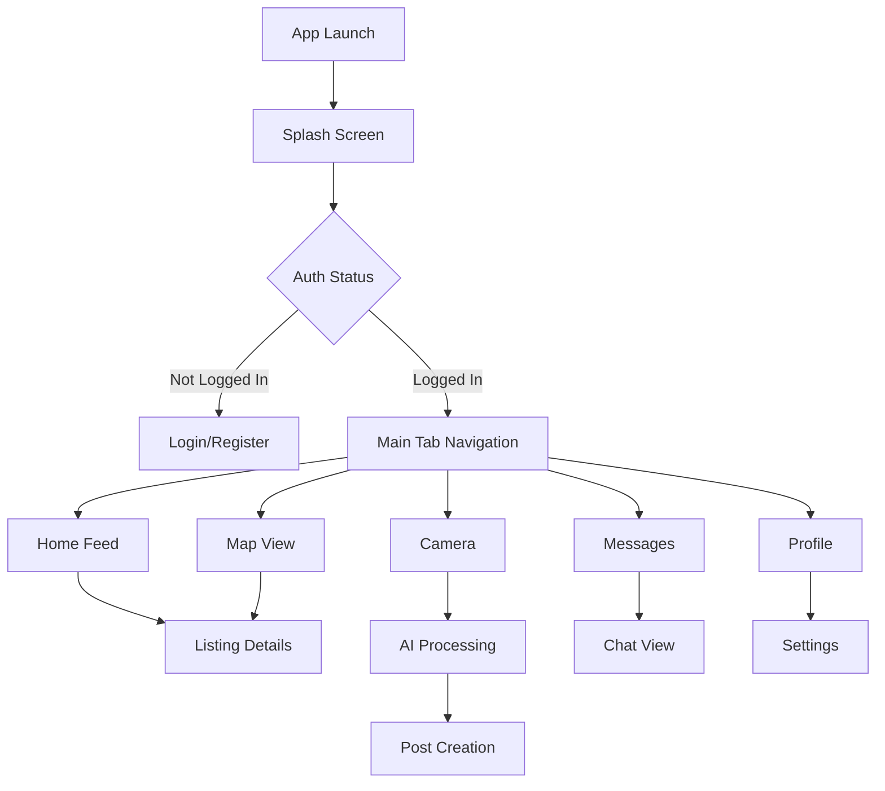
```mermaid
flowchart TD
    A[App Launch] --> B[Splash Screen]
    B --> C{Auth Status}
    C -->|Not Logged In| D[Login/Register]
    C -->|Logged In| E[Main Tab Navigation]
    
    E --> F[Home Feed]
    E --> G[Map View] 
    E --> H[Camera]
    E --> I[Messages]
    E --> J[Profile]
    
    F --> K[Listing Details]
    G --> K
    H --> L[AI Processing]
    L --> M[Post Creation]
    I --> N[Chat View]
    J --> O[Settings]
```

### 6.1.2 Screen Layouts

| Screen | Components | Interactions |
|--------|------------|--------------|
| Home Feed | - Pull-to-refresh list<br>- Category filters<br>- Sort options<br>- Card-based listings<br>- Distance indicators | - Tap to view details<br>- Swipe to save<br>- Filter button<br>- Search bar |
| Map View | - Full-screen map<br>- List toggle<br>- Filter overlay<br>- Location markers<br>- Search bar | - Marker clustering<br>- Tap markers<br>- Radius adjustment<br>- Current location |
| Camera | - Camera preview<br>- Capture button<br>- Gallery access<br>- Flash toggle<br>- AI feedback overlay | - Take photo<br>- Multiple shots<br>- Gallery import<br>- AI processing |
| Messages | - Chat list<br>- Unread indicators<br>- Last message preview<br>- Online status<br>- Search chats | - Tap to open chat<br>- Pull to refresh<br>- Swipe actions<br>- Block user |
| Profile | - Stats overview<br>- Achievement badges<br>- History tabs<br>- Settings access<br>- Points display | - Edit profile<br>- View history<br>- Manage settings<br>- Share profile |

## 6.2 Database Design

### 6.2.1 Schema Design

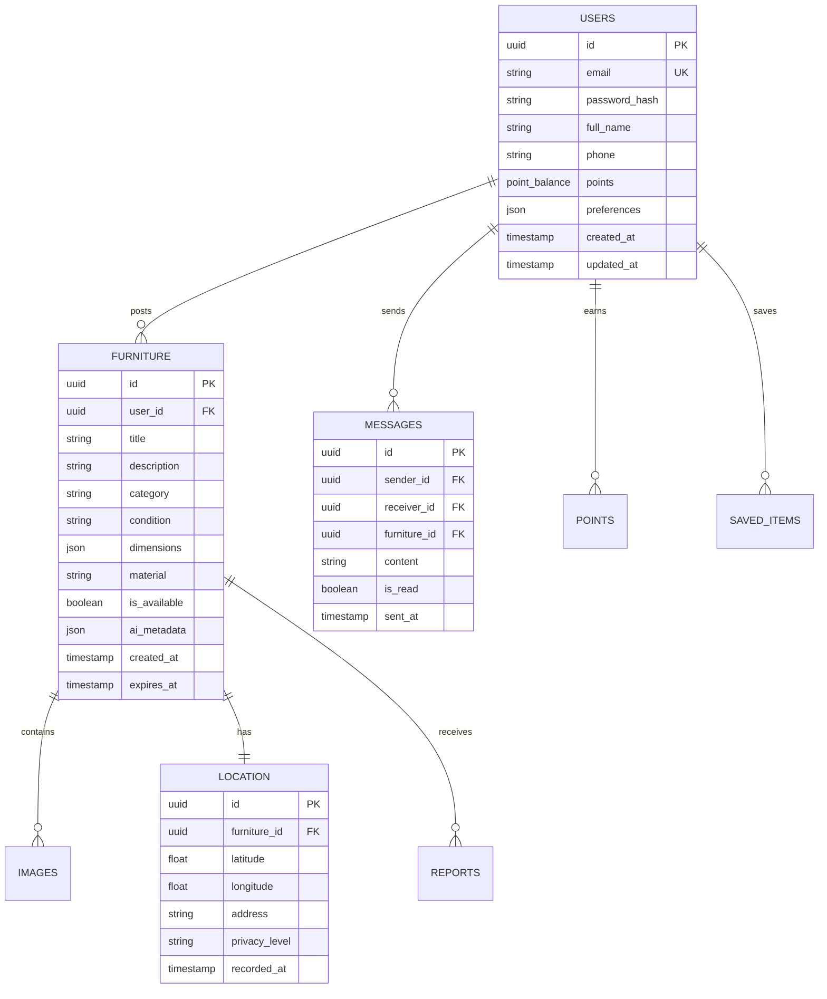
```mermaid
erDiagram
    USERS ||--o{ FURNITURE : posts
    USERS ||--o{ MESSAGES : sends
    USERS ||--o{ POINTS : earns
    USERS ||--o{ SAVED_ITEMS : saves
    
    FURNITURE ||--o{ IMAGES : contains
    FURNITURE ||--|| LOCATION : has
    FURNITURE ||--o{ REPORTS : receives
    
    USERS {
        uuid id PK
        string email UK
        string password_hash
        string full_name
        string phone
        point_balance points
        json preferences
        timestamp created_at
        timestamp updated_at
    }
    
    FURNITURE {
        uuid id PK
        uuid user_id FK
        string title
        string description
        string category
        string condition
        json dimensions
        string material
        boolean is_available
        json ai_metadata
        timestamp created_at
        timestamp expires_at
    }
    
    LOCATION {
        uuid id PK
        uuid furniture_id FK
        float latitude
        float longitude
        string address
        string privacy_level
        timestamp recorded_at
    }
    
    MESSAGES {
        uuid id PK
        uuid sender_id FK
        uuid receiver_id FK
        uuid furniture_id FK
        string content
        boolean is_read
        timestamp sent_at
    }
```

### 6.2.2 Database Partitioning

| Partition Type | Data | Strategy |
|----------------|------|-----------|
| User Data | Profiles, Preferences | Hash-based on user_id |
| Furniture Data | Listings, Images | Range-based on location |
| Messages | Chat History | Time-based partitioning |
| Analytics | Usage Data | Time-series partitioning |

## 6.3 API Design

### 6.3.1 RESTful Endpoints

| Endpoint | Method | Purpose | Request/Response |
|----------|--------|---------|------------------|
| `/api/v1/furniture` | GET | List furniture | Filters, pagination |
| `/api/v1/furniture` | POST | Create listing | Multipart form data |
| `/api/v1/furniture/{id}` | GET | Get details | Single listing |
| `/api/v1/furniture/{id}` | PUT | Update listing | JSON payload |
| `/api/v1/users/{id}/points` | GET | Get points | Points summary |
| `/api/v1/messages` | GET | List messages | Chat history |
| `/api/v1/messages` | POST | Send message | Message content |

### 6.3.2 WebSocket Events

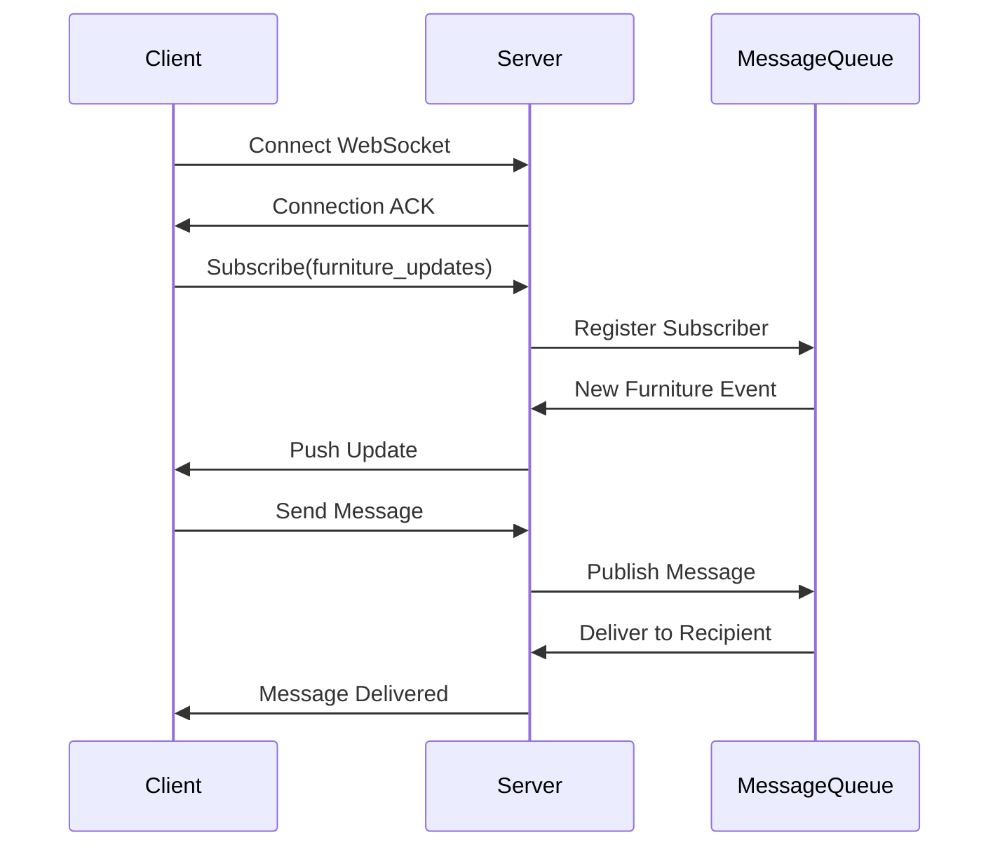
```mermaid
sequenceDiagram
    participant Client
    participant Server
    participant MessageQueue
    
    Client->>Server: Connect WebSocket
    Server->>Client: Connection ACK
    
    Client->>Server: Subscribe(furniture_updates)
    Server->>MessageQueue: Register Subscriber
    
    MessageQueue->>Server: New Furniture Event
    Server->>Client: Push Update
    
    Client->>Server: Send Message
    Server->>MessageQueue: Publish Message
    MessageQueue->>Server: Deliver to Recipient
    Server->>Client: Message Delivered
```

### 6.3.3 API Response Format

```json
{
  "status": "success",
  "data": {
    "id": "uuid",
    "type": "furniture",
    "attributes": {
      "title": "string",
      "description": "string",
      "location": {
        "lat": "float",
        "lng": "float"
      }
    },
    "relationships": {
      "user": {
        "id": "uuid",
        "type": "user"
      }
    },
    "meta": {
      "created_at": "timestamp",
      "updated_at": "timestamp"
    }
  }
}
```

### 6.3.4 API Security

| Security Layer | Implementation |
|----------------|----------------|
| Authentication | JWT Bearer tokens |
| Rate Limiting | 100 req/min per user |
| Input Validation | JSON Schema validation |
| Error Handling | Standard error codes |
| CORS | Whitelisted origins |
| API Versioning | URL-based (v1, v2) |

# 7. Security Considerations

## 7.1 Authentication and Authorization

### 7.1.1 Authentication Flow

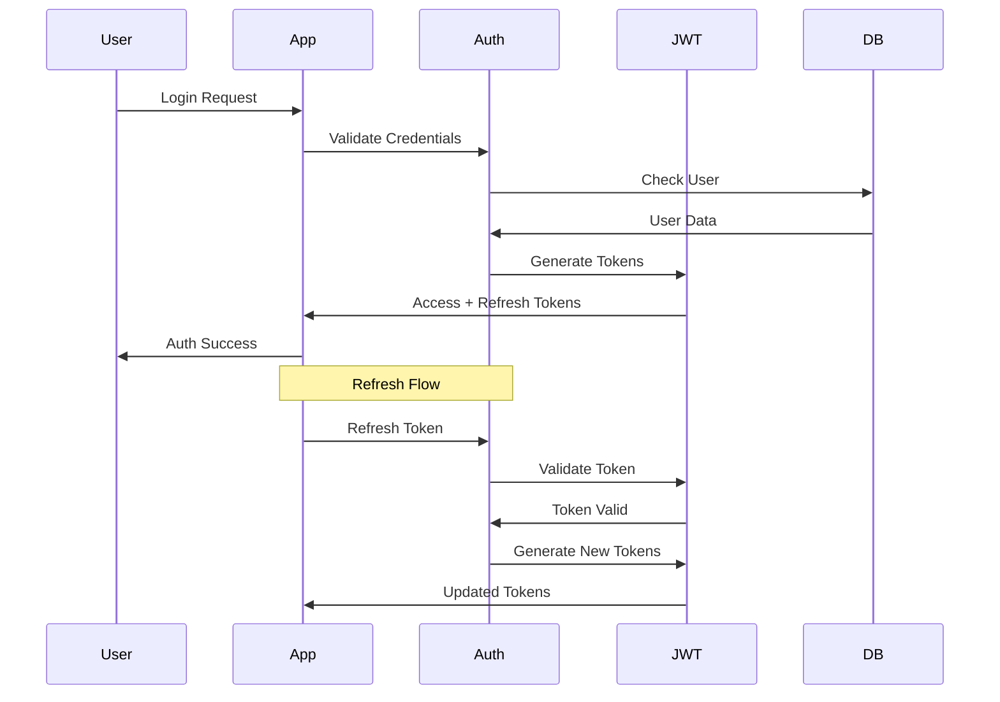
```mermaid
sequenceDiagram
    participant User
    participant App
    participant Auth
    participant JWT
    participant DB
    
    User->>App: Login Request
    App->>Auth: Validate Credentials
    Auth->>DB: Check User
    DB->>Auth: User Data
    Auth->>JWT: Generate Tokens
    JWT->>App: Access + Refresh Tokens
    App->>User: Auth Success
    
    Note over App,Auth: Refresh Flow
    App->>Auth: Refresh Token
    Auth->>JWT: Validate Token
    JWT->>Auth: Token Valid
    Auth->>JWT: Generate New Tokens
    JWT->>App: Updated Tokens
```

### 7.1.2 Authorization Matrix

| Role | Create Listings | View Listings | Message Users | Manage Profile | Admin Functions |
|------|----------------|---------------|---------------|----------------|-----------------|
| Anonymous | No | Yes (Limited) | No | No | No |
| User | Yes | Yes | Yes | Yes | No |
| Verified User | Yes | Yes | Yes | Yes | No |
| Moderator | Yes | Yes | Yes | Yes | Limited |
| Admin | Yes | Yes | Yes | Yes | Full |

### 7.1.3 Authentication Methods

- JWT-based authentication
- OAuth 2.0 integration for social login
- Multi-factor authentication for sensitive operations
- Biometric authentication support (TouchID/FaceID)
- Session management with sliding expiration
- Device fingerprinting for suspicious activity detection

## 7.2 Data Security

### 7.2.1 Encryption Standards

| Data Type | At Rest | In Transit | Key Management |
|-----------|----------|------------|----------------|
| User Credentials | AES-256 | TLS 1.3 | AWS KMS |
| Personal Data | AES-256 | TLS 1.3 | AWS KMS |
| Location Data | AES-256 | TLS 1.3 | AWS KMS |
| Messages | AES-256 | TLS 1.3 | AWS KMS |
| Media Files | AES-256 | TLS 1.3 | AWS KMS |

### 7.2.2 Data Protection Measures

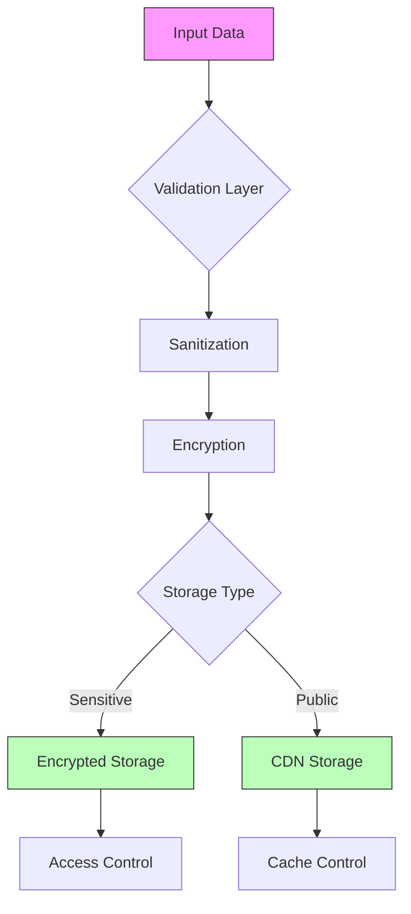
```mermaid
flowchart TD
    A[Input Data] --> B{Validation Layer}
    B --> C[Sanitization]
    C --> D[Encryption]
    D --> E{Storage Type}
    E -->|Sensitive| F[Encrypted Storage]
    E -->|Public| G[CDN Storage]
    F --> H[Access Control]
    G --> I[Cache Control]
    
    style A fill:#f9f,stroke:#333
    style F fill:#bfb,stroke:#333
    style G fill:#bfb,stroke:#333
```

### 7.2.3 Privacy Controls

- Data minimization principles
- Automated PII detection and redaction
- Privacy-preserving location fuzzing
- Configurable data retention periods
- GDPR/CCPA compliance controls
- Data export and deletion capabilities

## 7.3 Security Protocols

### 7.3.1 Network Security

| Layer | Protocol/Measure | Implementation |
|-------|-----------------|----------------|
| Transport | TLS 1.3 | Mandatory for all communications |
| API | HTTPS | Certificate pinning |
| WebSocket | WSS | Secure WebSocket with TLS |
| DNS | DNSSEC | DNS security extensions |
| CDN | Custom Headers | Security headers configuration |

### 7.3.2 Security Monitoring

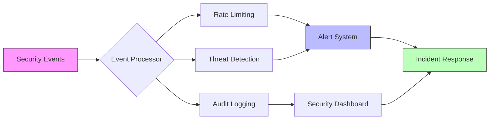
```mermaid
flowchart LR
    A[Security Events] --> B{Event Processor}
    B --> C[Rate Limiting]
    B --> D[Threat Detection]
    B --> E[Audit Logging]
    
    C --> F[Alert System]
    D --> F
    E --> G[Security Dashboard]
    
    F --> H[Incident Response]
    G --> H
    
    style A fill:#f9f,stroke:#333
    style F fill:#bbf,stroke:#333
    style H fill:#bfb,stroke:#333
```

### 7.3.3 Security Controls

- WAF (Web Application Firewall) implementation
- DDoS protection through AWS Shield
- Rate limiting per user/IP
- Input validation and sanitization
- SQL injection prevention
- XSS protection
- CSRF tokens
- Security headers configuration
- Regular security audits
- Vulnerability scanning

### 7.3.4 Incident Response

| Phase | Actions | Responsibility |
|-------|---------|----------------|
| Detection | Monitor security events | Security System |
| Analysis | Evaluate threat level | Security Team |
| Containment | Isolate affected systems | DevOps Team |
| Eradication | Remove security threat | Security Team |
| Recovery | Restore normal operation | DevOps Team |
| Post-Incident | Review and improve | Security Team |

### 7.3.5 Security Compliance

- Regular penetration testing
- Automated security scanning
- Code security reviews
- Security training for developers
- Compliance documentation
- Security policy enforcement
- Third-party security audits
- Vulnerability disclosure program
- Security patch management
- Incident response drills

# 8. Infrastructure

## 8.1 Deployment Environment

The Founditure platform utilizes a cloud-native infrastructure with multi-region deployment for optimal performance and reliability.

```mermaid
flowchart TB
    subgraph Production Environment
        A[Primary Region] --> B[Secondary Region]
        
        subgraph Region Components
            C[Application Tier]
            D[Database Tier]
            E[Cache Layer]
            F[Storage Layer]
        end
        
        A --> Region Components
        B --> Region Components
    end
    
    subgraph Development
        G[Development]
        H[Staging]
        I[QA]
    end
    
    Development --> Production Environment
```

### Environment Matrix

| Environment | Purpose | Scale | Region |
|------------|---------|--------|---------|
| Production | Live user traffic | Auto-scaling (2-20 nodes) | Multi-region |
| Staging | Pre-release testing | Fixed (2 nodes) | Single region |
| QA | Testing and validation | Fixed (1 node) | Single region |
| Development | Development work | On-demand | Single region |

## 8.2 Cloud Services

Primary cloud provider: Amazon Web Services (AWS)

### Core Services Configuration

| Service | Purpose | Configuration |
|---------|----------|--------------|
| ECS/EKS | Container orchestration | Production: EKS with 3 node groups<br>Other: ECS |
| RDS | Database hosting | Multi-AZ PostgreSQL, Read replicas |
| ElastiCache | Redis caching | Cluster mode with 3 shards |
| S3 | Object storage | Cross-region replication |
| CloudFront | CDN | Edge locations in target markets |
| Route 53 | DNS management | Latency-based routing |
| ECR | Container registry | Private repository |
| CloudWatch | Monitoring | Custom metrics, alerts |
| AWS KMS | Key management | Automatic key rotation |

## 8.3 Containerization

```mermaid
flowchart TB
    subgraph Container Architecture
        A[Base Images] --> B[Service Images]
        B --> C[Running Containers]
        
        subgraph Service Containers
            D[API Services]
            E[Background Workers]
            F[AI Services]
        end
        
        C --> Service Containers
    end
```

### Docker Configuration

| Image Type | Base Image | Purpose |
|------------|------------|----------|
| API Services | node:18-alpine | Main application services |
| Workers | node:18-alpine | Background processing |
| AI Services | python:3.9-slim | ML model serving |
| Monitoring | grafana/grafana | Metrics visualization |
| Cache | redis:alpine | Data caching |

## 8.4 Orchestration

Kubernetes (EKS) configuration for production environment:

```mermaid
flowchart TB
    subgraph Kubernetes Cluster
        A[Ingress Controller] --> B[Service Mesh]
        
        subgraph Workload Pods
            C[API Pods]
            D[Worker Pods]
            E[AI Pods]
        end
        
        B --> Workload Pods
        
        subgraph Infrastructure Pods
            F[Monitoring]
            G[Logging]
            H[Service Discovery]
        end
        
        B --> Infrastructure Pods
    end
```

### Kubernetes Resources

| Resource Type | Purpose | Configuration |
|--------------|---------|---------------|
| Deployments | Service management | Rolling updates, auto-scaling |
| StatefulSets | Stateful services | Database, cache clusters |
| ConfigMaps | Configuration | Environment-specific settings |
| Secrets | Sensitive data | Encrypted credentials |
| Services | Network exposure | Internal/external routing |
| HPA | Auto-scaling | CPU/Memory based scaling |

## 8.5 CI/CD Pipeline

```mermaid
flowchart LR
    A[Source Code] --> B[Build]
    B --> C[Test]
    C --> D[Security Scan]
    D --> E[Artifact Creation]
    E --> F{Environment}
    F -->|Dev| G[Development]
    F -->|Staging| H[Staging]
    F -->|Prod| I[Production]
```

### Pipeline Stages

| Stage | Tools | Actions |
|-------|-------|---------|
| Source | GitHub | Code hosting, version control |
| Build | Jenkins | Compile, lint, build containers |
| Test | Jest, Cypress | Unit tests, integration tests |
| Security | SonarQube, Snyk | Code analysis, vulnerability scanning |
| Artifact | ECR | Container image storage |
| Deploy | ArgoCD | Kubernetes deployment |
| Monitor | Prometheus | Performance monitoring |

### Deployment Strategy

| Environment | Strategy | Approval | Rollback |
|------------|----------|----------|-----------|
| Development | Direct Push | Automated | Manual |
| Staging | Blue/Green | Team Lead | Automated |
| Production | Canary | Change Board | Automated |

### Automation Matrix

| Process | Tool | Frequency | Trigger |
|---------|------|-----------|---------|
| Code Build | Jenkins | On commit | Push to main |
| Unit Tests | Jest | On build | Pre-merge |
| Integration Tests | Cypress | Daily | Scheduled |
| Security Scan | SonarQube | On build | Pre-deploy |
| Performance Tests | k6 | Weekly | Scheduled |
| Backup Verification | AWS Backup | Daily | Scheduled |

# APPENDICES

## A. Additional Technical Information

### A.1 AI Model Specifications

| Component | Specification | Details |
|-----------|--------------|----------|
| Image Recognition | TensorFlow 2.x | Pre-trained MobileNetV3 base |
| Object Detection | YOLO v5 | Custom-trained on furniture dataset |
| Classification | FastAI | Fine-tuned ResNet50 architecture |
| Training Pipeline | PyTorch | Distributed training on AWS SageMaker |
| Model Serving | TensorFlow Serving | GPU-accelerated inference |
| Model Format | ONNX | Cross-platform compatibility |

### A.2 Cache Strategy

```mermaid
flowchart TD
    A[Client Request] --> B{Cache Check}
    B -->|Hit| C[Return Cached Data]
    B -->|Miss| D[Fetch Data]
    D --> E[Process Data]
    E --> F[Update Cache]
    F --> G[Return Data]
    
    subgraph Cache Layers
        H[Browser Cache]
        I[CDN Cache]
        J[API Cache]
        K[Database Cache]
    end
    
    B --> Cache Layers
```

### A.3 Error Handling Matrix

| Error Type | Handling Strategy | User Feedback |
|------------|------------------|---------------|
| Network Timeout | Exponential backoff retry | Connection error message |
| Image Upload Failure | Local queue with retry | Upload pending status |
| Location Error | Default to manual entry | Location services prompt |
| AI Processing Error | Fallback to manual classification | Processing status message |
| Authentication Error | Refresh token flow | Re-authentication prompt |

## B. Glossary

| Term | Definition |
|------|------------|
| Furniture Recovery | Process of documenting and collecting discarded furniture |
| Privacy Zone | Configurable area where exact locations are obscured |
| Point Multiplier | Bonus factor applied to points earned during special events |
| Collection Window | Time period during which a posted item remains available |
| Trust Score | User reliability metric based on successful interactions |
| Geo-fence | Virtual perimeter for location-based notifications |
| Shadow Ban | Restricted visibility of problematic users without notification |
| Cool-down Period | Mandatory wait time between certain actions |

## C. Acronyms

| Acronym | Full Form |
|---------|-----------|
| API | Application Programming Interface |
| AWS | Amazon Web Services |
| CDN | Content Delivery Network |
| CORS | Cross-Origin Resource Sharing |
| DNS | Domain Name System |
| ECS | Elastic Container Service |
| ELK | Elasticsearch, Logstash, Kibana |
| GDPR | General Data Protection Regulation |
| gRPC | Google Remote Procedure Call |
| HPA | Horizontal Pod Autoscaling |
| JWT | JSON Web Token |
| KMS | Key Management Service |
| MQTT | Message Queuing Telemetry Transport |
| ONNX | Open Neural Network Exchange |
| REST | Representational State Transfer |
| RTO | Recovery Time Objective |
| S3 | Simple Storage Service |
| SSL | Secure Sockets Layer |
| TLS | Transport Layer Security |
| WAF | Web Application Firewall |
| WCAG | Web Content Accessibility Guidelines |
| YOLO | You Only Look Once |

## D. System Health Metrics

```mermaid
flowchart LR
    A[System Metrics] --> B[Performance]
    A --> C[Reliability]
    A --> D[Security]
    
    B --> E[Response Time]
    B --> F[Throughput]
    B --> G[Resource Usage]
    
    C --> H[Uptime]
    C --> I[Error Rate]
    C --> J[Recovery Time]
    
    D --> K[Auth Success]
    D --> L[Threat Detection]
    D --> M[Audit Logs]
```

## E. Integration Dependencies

| Integration | Version | Purpose | Update Frequency |
|-------------|---------|---------|------------------|
| Google Maps | v3.52 | Location services | Quarterly |
| Firebase Auth | v9.x | Authentication | Monthly |
| AWS SDK | v3.x | Cloud services | Monthly |
| TensorFlow.js | v3.x | Client-side AI | Quarterly |
| Socket.io | v4.x | Real-time messaging | Semi-annually |
| Redis | v6.x | Caching | Annually |
| PostgreSQL | v14.x | Primary database | Annually |
| MongoDB | v5.x | Document storage | Semi-annually |